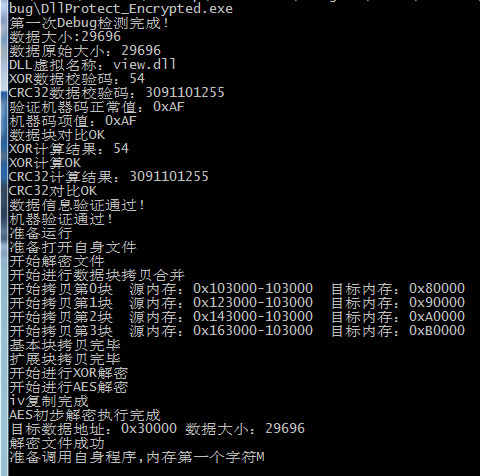

##### 工程说明

By lizhirui
https://www.52pojie.cn/thread-808473-1-1.html


##### DllProtect

加密程序。加密dll文件。加密原理：dll内容使用AES和OR加密，增加CRC校验，写入到shell程序的尾部，生成文件XXXX_Encrypted.exe

加密程序会将以下结果体写入到加壳程序。

```c++
typedef struct DATA_INFO
{
	DWORD FileSize;
	DWORD FileOriginSize;
	char *FileAESPassword;
	char *FileXORPassword;
	char *DLLVirtualName;
	bool VerifyMachineCode;
	uint64 MachineCode;
	char XORDataVerifyCode;
	DWORD CRC32DataVerifyCode;
}DATA_INFO;
```
加密程序

##### Shell

脱壳程序。执行XXXX_Encrypted.exe，将dll解密出来,包括了虚拟机检测，调试检测,内存加载dll。

Shell程序无法单独调试。




###### 虚拟机检测

```c++
inline bool IsInsideVMWare()
{
	bool rc = true;

	__try
	{
		__asm
		{
			push   edx
				push   ecx
				push   ebx

				mov    eax, 'VMXh'
				mov    ebx, 0  // 将ebx设置为非幻数’VMXH’的其它值
				mov    ecx, 10 // 指定功能号，用于获取VMWare版本，当它为0x14时用于获取VMware内存大小
				mov    edx, 'VX' // 端口号
				in     eax, dx // 从端口dx读取VMware版本到eax
				//若上面指定功能号为0x14时，可通过判断eax中的值是否大于0，若是则说明处于虚拟机中
				cmp    ebx, 'VMXh' // 判断ebx中是否包含VMware版本’VMXh’，若是则在虚拟机中
				setz[rc] // 设置返回值

				pop    ebx
				pop    ecx
				pop    edx
		}
	}
	__except (EXCEPTION_EXECUTE_HANDLER)  //如果未处于VMware中，则触发此异常
	{
		rc = false;
	}

	return rc;
}

inline bool IsVirtualPC_LDTCheck()
{
	unsigned short ldt_addr = 0;
	unsigned char ldtr[2];

	_asm sldt ldtr
	ldt_addr = *((unsigned short *)&ldtr);
	return ldt_addr != 0x00000000;
}

inline bool IsVirtualPC_GDTCheck()
{
	unsigned int gdt_addr = 0;
	unsigned char gdtr[6];

	_asm sgdt gdtr
	gdt_addr = *((unsigned int *)&gdtr[2]);
	return (gdt_addr >> 24) == 0xff;
}

inline bool IsVirtualPC_TSSCheck()
{
	unsigned char mem[4] = { 0 };

	__asm str mem;
	return (mem[0] == 0x00) && (mem[1] == 0x40);
}

inline bool DetectVM()
{
	HKEY hKey;

	char szBuffer[64];

	unsigned long hSize = sizeof(szBuffer)-1;

	if (RegOpenKeyEx(HKEY_LOCAL_MACHINE, "HARDWARE\\DESCRIPTION\\System\\BIOS\\", 0, KEY_READ, &hKey) == ERROR_SUCCESS)
	{

		RegQueryValueEx(hKey, "SystemManufacturer", NULL, NULL, (unsigned char *)szBuffer, &hSize);

		if (strstr(szBuffer, "VMWARE"))
		{
			RegCloseKey(hKey);
			return true;
		}

		RegCloseKey(hKey);
	}

	return false;
}
```

###### 调试检查 

```c++

inline void BeginCheckTimingDebug()
{
#ifdef DEBUGCHECK
	__asm
	{
		PUSHAD
			CPUID
			RDTSC
			MOV tEAX,EAX
			MOV tEDX,EDX
			POPAD
	}

#endif
}

inline void EndCheckTimingDebug(DWORD TimeDelta)
{
#ifdef DEBUGCHECK
	__asm
	{
		PUSHAD
			CPUID
			MOV ECX,tEAX
			MOV EBX,tEDX
			RDTSC
			CMP EDX,EBX
			JA Debugger_Found
			SUB EAX,ECX
			CMP EAX,TimeDelta
			JA Debugger_Found
			JMP safe

		Debugger_Found:

		POPAD
			MOV ESP,MainESP
			JMP ExitAddress

		safe:
		POPAD
	}
#endif
}

inline void CheckDebug()
{

#ifdef DEBUGCHECK
	int debuged;
	DWORD DebugPort;
	DWORD ReturnLen;

	//虚拟机检测
	(IsInsideVMWare() || IsVirtualPC_LDTCheck() || IsVirtualPC_GDTCheck() || IsVirtualPC_TSSCheck() || DetectVM()) ? ShellExit() : 0;

	__asm
	{
		PUSHAD

			;check PEB.BeingDebugged directly

			MOV EAX,DWORD PTR FS:[0x30]
			MOVZX EAX,BYTE PTR [EAX+2]
			TEST EAX,EAX
			JNZ Debugger_Found
			JMP safe

		Debugger_Found:

		POPAD
			MOV ESP,MainESP
			MOV EBP,MainEBP
			JMP ExitAddress

		safe:

		;(PEB.ProcessHeap)
			MOV EBX,DWORD PTR FS:[030H]

			;Check if PEB.NtGlobalFlag != 0
			CMP DWORD PTR [EBX+068H],0
			JNE Debugger_Found
			;query for the PID of CSRSS.EXE
			CALL [CsrGetProcessId]

			;try to open the CSRSS.EXE process
			PUSH EAX
			PUSH FALSE
			PUSH PROCESS_QUERY_INFORMATION
			CALL [OpenProcess]

			;if OpenProcess() was successful
			;process is probably being debugged
			TEST EAX,EAX
			JNZ Debugger_Found

		EXIT:
		POPAD
	}

	(CheckRemoteDebuggerPresent(GetCurrentProcess(),&debuged) == FALSE) ? ShellExit() : 0;	
	(debuged == TRUE) ? ShellExit() : 0;
	NtQueryInformationProcess(GetCurrentProcess(),ProcessDebugPort,&DebugPort,4,&ReturnLen);
	(DebugPort != 0) ? ShellExit() : 0;

#endif
}
```


##### 应用
将应用程序的核心算法写在dll里面，每次主程序启动的时候需要重新解密和解压dll。增加破解难度。


